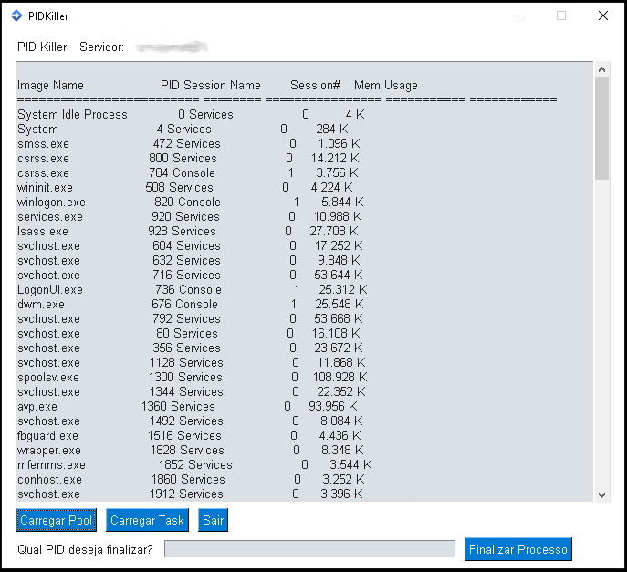

# PIDKiller 💻

<div></div>

<h4> 
	Status do projeto: Finalizado :heavy_check_mark:
</h4>


Tópicos :writing_hand:
=================
<!--ts-->
   * [Descrição do Projeto](#descrição-do-projeto-file_folder)
   * [Funcionalidades](#funcionalidades-gear)
   * [Pré-requisitos](#pré-requisitos-pushpin)
   * [Bibliotecas utilizadas](#bibliotecas-utilizadas-books)
   * [Observações](#observações-eyes)
   * [Como usar](#como-usar-arrow_forward)
   * [Screenshot](#screenshot-camera)
   * [Desenvolvedores e Contribuintes](#desenvolvedores-e-contribuintes-computer)
   * [Licença](#licença-grey_exclamation)
<!--te-->

Descrição do Projeto :file_folder:
========================
Finalizar programas rodando em maquinas remotas.

Funcionalidades :gear:
========================
<div> :heavy_check_mark: Configuravel via arquivo Config.ini (Nome do servidor, usuario e senha para conexão).</div>
<p> </p>
<div> :heavy_check_mark: Finaliza programas em maquinas remotas, a partir do PID do processo.</div>
<p> </p>
<div> :heavy_check_mark: Finaliza aplicações rodando em servidor IIS, a partir do PID.</div>
<p> </p>
<div> :heavy_check_mark: Interface grafica simples e facil de utilizar.</div>

Pré-requisitos :pushpin:
========================
<div><b> :warning: OBRIGATÓRIO :warning: </b> - Arquivo load.gif (Pode ser qualquer gif de loading, porém recomendo o mesmo que eu utilizei).</div>
<p></p>

Criar arquivo config.ini com o conteudo abaixo:
```
[Server]
IP=nome-do-servidor
user=usuario@dominio
passwd=senha
```
No Python:
```
pip install wmi
```
```
pip install PySimpleGUI
```
```
pip install pysmb
```

Bibliotecas utilizadas :books:
==============================
- [WMI](https://pypi.org/project/WMI/)
- [PySimpleGUI](https://pypi.org/project/PySimpleGUI/)
- [PySMB](https://pypi.org/project/pysmb/)
- [ConfigParser](https://docs.python.org/3/library/configparser.html)
- [Time](https://docs.python.org/3/library/time.html)
- [Sys](https://docs.python.org/3/library/sys.html)
- [MultiProcessing](https://docs.python.org/3/library/multiprocessing.html)

Observações :eyes:
==================
<div>A ideia deste projeto surgiu na necessidade de finalizar aplicações travadas em maquinas e servidores remotos.</div>
<div>Como algumas aplicações eram pesadas, levava muito tempo para conseguir acessar remoto as maquinas e finalizar a aplicação atraves do Gerenciador de Tarefas.</div>
<div>Assim, com este programa, não é necessario o acesso remoto para executar a ação.</div>
<p></p>
<div>Outra motivação, foi a necessidade de finalizar aplicações travadas no servidor IIS.</div>
<div>No servidor IIS, quando é dado o stop em uma aplicação, ele demora certo tempo para matar todas as conexão e liberar a inicialização da aplicação novamente.</div>
<div>Com este programa, é possivel listar as aplicações rodando no IIS e forçar a finalização da aplicação travada.</div>

Como usar :arrow_forward:
======================================
No terminal, navegar até o diretório onde se encontram os arquivos [config.ini](https://github.com/godoyp/PIDKiller/blob/main/config.ini), [load.gif](https://github.com/godoyp/PIDKiller/blob/main/load.gif) e [PIDKiller.py](https://github.com/godoyp/PIDKiller/blob/main/PIDKiller.py) e digitar:
```
python PIDKiller.py
```

Screenshot :camera:
===================



Desenvolvedores e Contribuintes :computer:
==========================================

- Pedro Godoy - [LinkedIn](https://www.linkedin.com/in/pedrogodoy00/) - [Email](pedro_godoy2@hotmail.com)

Licença :grey_exclamation:
==========================

The [MIT License]() (MIT)

Copyright :copyright: 2021 - PIDKiller
